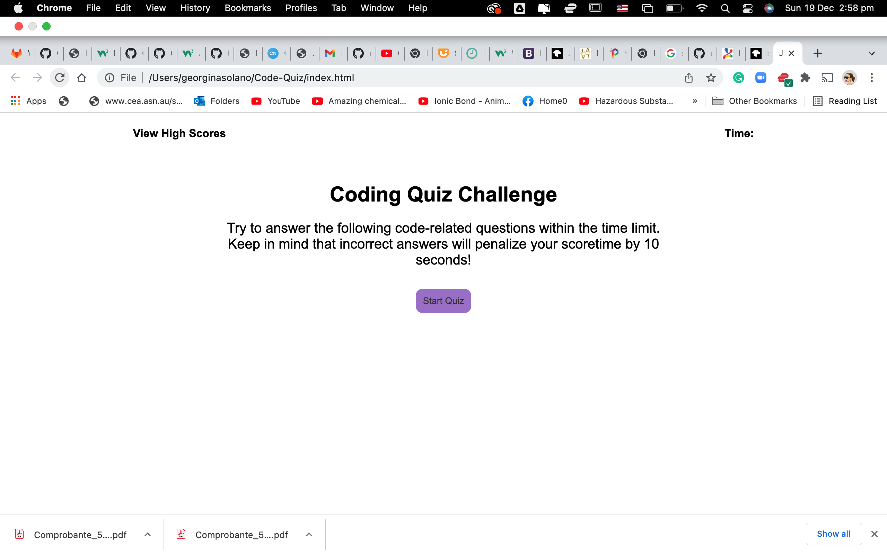
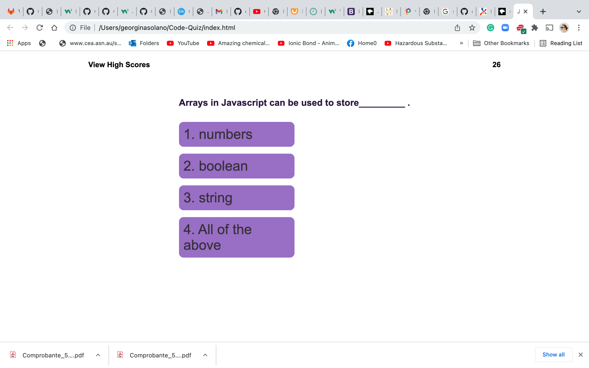
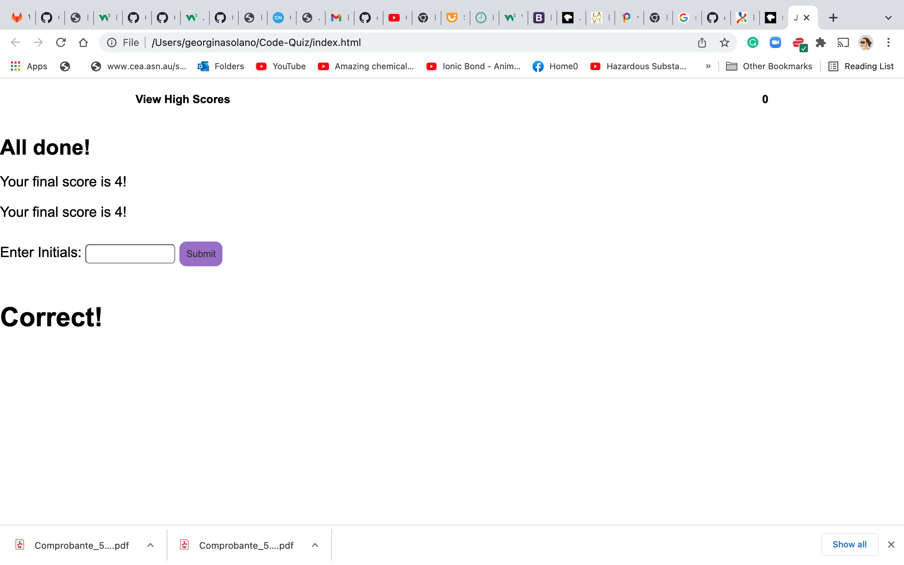

# Code-Quiz
Week 04 Web APIs: Code Quiz
Purpose:
* When game is started the timer counts down game is over when no more questions left or timer reaches zero.
* questions and answer options are stores in a local array, questions are shuffled and when a question is selected this is appended to the questions container. 

Pending:
task is incomplete 
* failed to complete styling.
* highscore recording not completed.

Partially working quiz.

